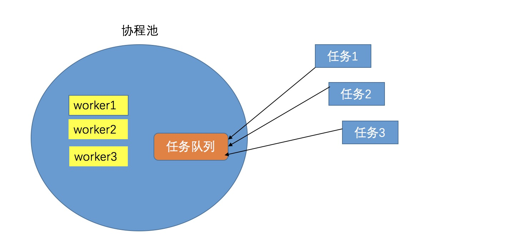

#### 目的学习go协程池
- 网上go协程池大同小异，理解原理就可以了，我是根据bilibili上一个视频操作的，讲的还挺好的，自行搜索下，不过因为这个视频中任务队列是没有长度限制的，所以在那个基础上进行改编。

#### 看下协程池的原理
  

#### 协程池结构体,并且建立有缓存的channel
```go
type Workpool struct {
	Jobchannel chan *Task
	Workernum int
}
// maxsize 工人多少个，maxlen 多长的管道
func NewWorkpool(maxsize int,maxlen int) *Workpool {
	w := Workpool{
		Jobchannel:      make(chan *Task,maxlen),
		Workernum:       maxsize,
	}
	return &w
}
```
#### Task 任务，这里我是派发了十个任务，然后休息两秒，然后再派发
```go
func (t *Task) Execute(){
	fmt.Println("任务id为：",t.Id,",当前时间为：",time.Now())
	t.f()
	time.Sleep(2 * time.Second)
}
```

#### 完整代码如下
```go
package cache

import (
	"fmt"
	"sync"
	"time"
)

type Task struct {
	f func() error
	Id int
}
func Newtask(arg_f func() error,id int) *Task{
	t :=Task{
		f:	arg_f,
		Id:	id,
	}
	return &t
}
func (t *Task) Execute(){
	fmt.Println("任务id为：",t.Id,",当前时间为：",time.Now())
	t.f()
	time.Sleep(2 * time.Second)
}
type Workpool struct {
	Jobchannel chan *Task
	Workernum int
}
// maxsize 工人多少个，maxlen 多长的管道
func NewWorkpool(maxsize int,maxlen int) *Workpool {
	w := Workpool{
		Jobchannel:      make(chan *Task,maxlen),
		Workernum:       maxsize,
	}
	return &w
}


func (p *Workpool) AllocateJobTask(maxnumjobs int) {
	for i:=0;i<maxnumjobs;i++{
		t := Newtask(func() error {
			//任务是打印当前时间
			//fmt.Println("任务id为：",i,",当前时间为：",time.Now())
			return nil
		},i)
		p.Jobchannel <- t
	}
	close(p.Jobchannel)
}
func (p *Workpool) CreateWorkPool(){
	var wg sync.WaitGroup
	for i:=0; i<p.Workernum;i++  {
		go p.Work(&wg,i)
		wg.Add(1)
	}
	wg.Wait()

}
func (p *Workpool) Work(wg *sync.WaitGroup,id int){
	for job :=range p.Jobchannel{
		job.Execute()
		fmt.Println("我是工人:",id,"正在工作job:",job.Id)
	}
	wg.Done()
}

func GetCacheChannel(){
	startTime :=time.Now()
	w :=NewWorkpool(10,10)
	maxnumjobs :=100
	//先初始化线程池
	go w.AllocateJobTask(maxnumjobs)
	w.CreateWorkPool()

	endTime := time.Now()
	diff := endTime.Sub(startTime)
	fmt.Println("total time taken ", diff.Seconds(), "seconds")
}

```

写完这段代码，网上还有其他协程池的原理，大同小异
- [<font color=#0099ff>其他高效协程池做法</font>](https://segmentfault.com/a/1190000018193161)
